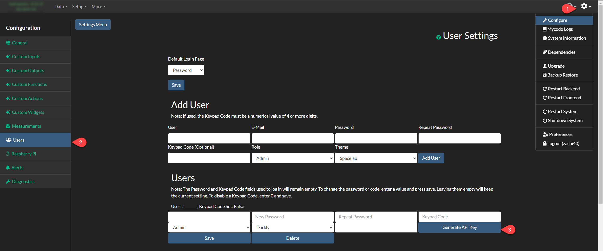

# Mycodo App Home Assistant Integration

## Overview
This integration allows you to connect and control your Mycodo App with Home Assistant.

## Installation

### Install with HACS (Recommended)
1. Add the URL to this repository as a custom integration in HACS.
2. Search for "Mycodo App Integration" and install it.
3. Restart Home Assistant.

### Manual Installation
1. Open the directory for your Home Assistant configuration (where you find `configuration.yaml`).
2. If you do not have a `custom_components` directory there, create it.
3. In the `custom_components` directory, create a new folder called `mycodo`.
4. Download all the files from the `custom_components/mycodo/` directory in this repository.
5. Place the downloaded files in the newly created `mycodo` directory.
6. Restart Home Assistant.
7. In the Home Assistant UI, go to "Configuration" -> "Integrations" and click "+" to add a new integration.
8. Search for "Mycodo App" and follow the on-screen instructions.

## Obtaining the Token
To integrate your Mycodo App with Home Assistant, you need an API token. Follow these steps to obtain the token:

1. Log in to your Mycodo App.
2. Click on the "Settings" button.
3. Navigate to "Configure".
4. Go to "Users" in the side menu.
5. In the "Users" section, click on the "Generate API Key" button.
6. Copy the generated token and keep it secure.

Once you have the token, you can configure the integration in Home Assistant by providing the token during the setup process.

## Configuration
1. In Home Assistant, go to "Configuration" -> "Integrations".
2. Select "Mycodo App" and enter the API token you obtained earlier.
3. Complete the configuration by following the on-screen instructions.

For more detailed instructions, refer to the documentation in this repository.

## Support
If you encounter any issues or have questions, please open an issue in this repository or contact the maintainers.

---

Happy automating with Mycodo and Home Assistant!
